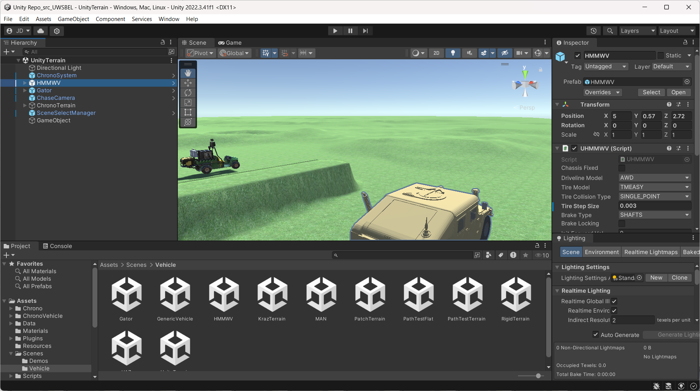
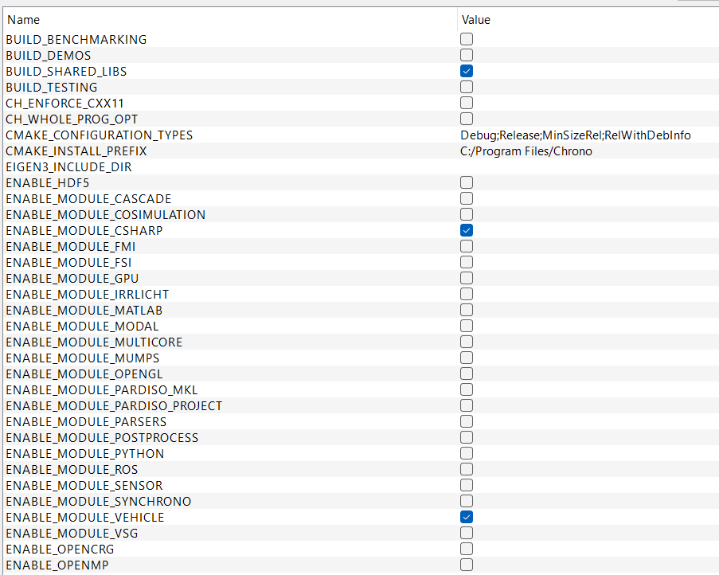

# ChronoUnity

ChronoUnity is a C# wrapping to integrate the [Chrono](https://projectchrono.org/) C++ physics engine within Unity, allowing for advanced physics simulations and visualisation within the Unity environment. This integration leverages SWIG (Simplified Wrapper and Interface Generator) to wrap Chrono's C++ functionality into C# scripts, for the purpose of making them accessible within Unity projects.

## Overview

ChronoUnity brings together the Chrono high-fidelity and high-performance physics capabilities with the versatile and intuitive Unity game engine. This combination enables users to create complex physical simulations, using Chrono's vehicle dynamics, rigid body system, collision detection, and more, with the visual and interactive strengths of Unity.

## Key Features
  The included demos highlight a number of the following key features:
- **Chrono Core module:** Utilise Project Chrono's capabilities for NSC and SMC contact systems. Multiple solvers and approaches supported for accurate physics simulation within the Unity environment.
- **Chrono Vehicle module:** Currently supported vehicles are the HMMWV, Gator, Kraz, UAZBus, MAN and Generic Vehicle specified through JSON files. Unity Terrain interaction is supported through Chrono's RigidTerrain.
- **Unity and Chrono physics system interactions:** ChronoUnity allows for one-way interactions between Unity and Chrono physics by adding Unity colliders to Chrono objects. While Chrono can easily influence Unity's physics world, the reverse has not been developed.
- **Joints, forces, and rigid body support:** Several multibody systems including rigid bodies, joints, and forces are demonstrated in the provided physics scenes.

## Limitations

Not all C++ Chrono functionality is available in ChronoUnity. The current SWIG wrapping primarily supports core and essential vehicle functions, with more advanced or less commonly used features potentially unavailable. Users should refer to the Unity demos and generated C# classes to see which methods and properties are accessible. 
- Not all vehicle models are available. 
- Track vehicle and robot models are currently not available.

## Prerequisites

- [Unity Engine](https://unity.com/products/unity-engine)
  The current version of ChronoUnity was developed and tested in Unity 2022.3.41.f1. 
  Other Unity versions may also work, but were not tested.
- Chrono C# wrapper scripts
  These are SWIG-generated C# scripts that wrap Chrono C++ classes and functions. 
- Chrono shared libraries:
  - Chrono core module
  - Chrono::Vehicle module
  - Chrono C# wrapper libraries for the core and vehicle modules

While the development ChronoUnity code in the `main` branch will be periodically updated to work with the Chrono development branch (`main` branch of the [Chrono](https://github.com/projectchrono/chrono) repository), we **strongly** recommend using the latest ChronoUnity release (currently 1.0.0).

Matching ChronoUnity and Chrono releases, as well as the corresponding recommended Unity version, are as follows:

| ChronoUnity release (branch \| tag) | Chrono release (branch \| tag) | Recommended Unity version |
| :----                               | :----                          | :----                     |
| `release/1.0` \| 1.0.0              | `release/9.0` \| 9.0.1         | 2022.3.41.f1              |

## Installation

Start by obtaining the ChronoUnity sources:
- [**Recommended**] Download and extract the `Source code` archive (zip or tar.gz) for the desired release from the ChronoUnity [Releases](https://github.com/projectchrono/chrono-unity/releases) page.
- Alternatively, clone the ChronoUnity repository and switch to the desired **release** branch.

### [Recommended] Installation using pre-built Chrono assets

1. Download the pre-built Chrono assets from the ChronoUnity [Releases](https://github.com/projectchrono/chrono-unity/releases) page:
   - download the zip file with the Chrono C# scripts; e.g., `Chrono.9.0.1.CSharp.zip`
   - download the zip file with Chrono shared libraries for your OS (Windows or Linux); e.g., `Chrono.9.0.1.Windows.x64.zip`

2. Extract the two archives in the ChronoUnity `Assets/Plugins` directory.

### Installation using a custom Chrono library build

To build the necessary Chrono modules yourself, you need CMake, Swig 4.x, and any other pre-requisites for the relevant Chrono modules. 

1. **Clone the Chrono repository**
   - Clone the Chrono [repository](https://github.com/projectchrono/chrono) and switch to the desired Chrono release version (e.g., the `release\9.0` branch or the `9.0.1` tag).

2. **Configure Chrono**
   - Follow the instructions provided in the Project Chrono [installation guides](https://api.projectchrono.org/9.0.0/install_guides.html) to configure and build Chrono from source.

   - During Chrono CMake configuration, ensure you enable building shared libraries (`BUILD_SHARED` set to `ON`) and that the `Chrono::CSharp` and `Chrono::Vehicle` modules are enabled. A minimum Chrono build required for ChronoUnity is as follows:
   
    

3. **Generate Chrono libraries and SWIG C# wrappers**
   - Build the Chrono project as appropriate for your OS and build tools. We recommend a *Release* build.
   - The SWIG-generated C# scripts can be found in the `chrono_csharp/` directory of the build tree, organized under two subdirectories, `core/` and `vehicle/`.
   - The Chrono shared libraries can be found in the build tree (under `bin/Release/` on Windows and under `lib/` or `lib/Release/` on Linux).

5. **Set up the Unity project**
   - Navigate to your ChronoUnity project directory.

   - Copy the shared Chrono libraries (`.dll` or `.so` files, depending on your OS), along with the C# script directory `chrono_csharp/` into the `Assets/Plugins` directory of the ChronoUnity project.

   **IMPORTANT**: The SWIG wrapping process generates duplicates of some types. Unity will raise errors on acount of duplicates causing ambiguity. One easy way to eliminate these duplicates is to copy all C# scripts from `core/` and `vehicle/` into a single directory (e.g., in `Assets/Plugins/chrono_csharp/`) allowing duplicates to be overwritten. However, make sure to overwrite the `vehicle` scripts with the `core` scripts -- in other words, **give priority** to the `core` scripts.

## Using ChronoUnity
1. Launch UnityHub, select "Add a project from disk" and select the ChronoUnity directory (`chrono-unity`).
2. Launch the project **chrono-unity** from within UnityHub, wait for compilation, then open one of the physics or vehicle demo scenes.

## Documentation

For additional information on how to use ChronoUnity, please refer to the following resources:

- **Chrono** [documentation](https://api.projectchrono.org/9.0.0/)
- **SWIG** [documentation](http://www.swig.org/)
- **Unity** [documentation](https://docs.unity3d.com/)
